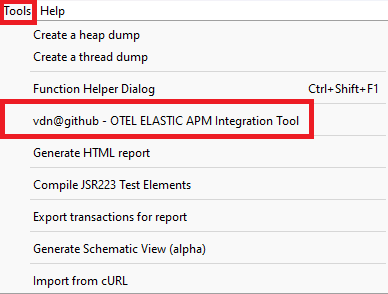
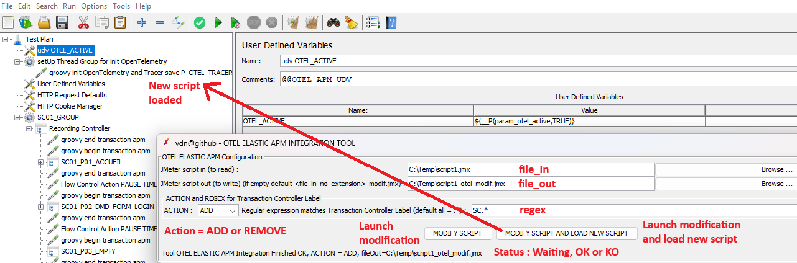
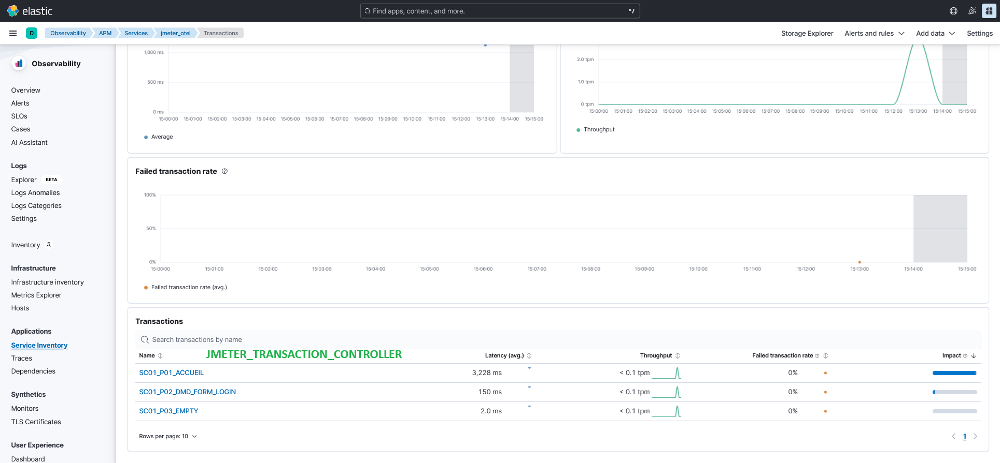
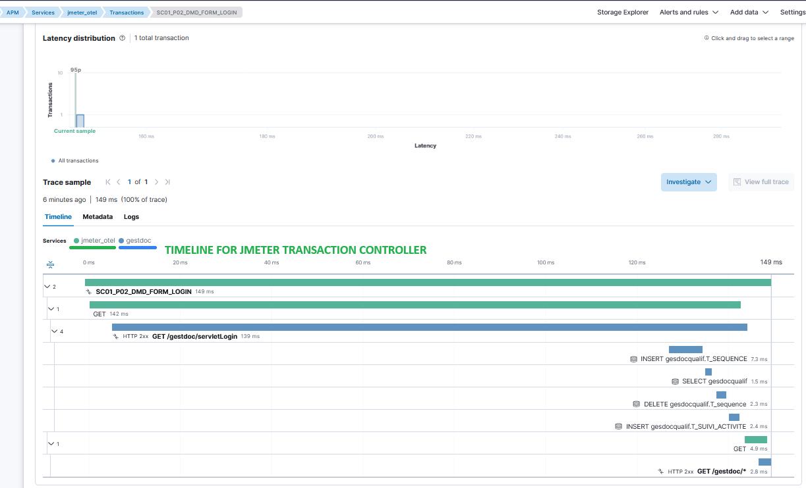
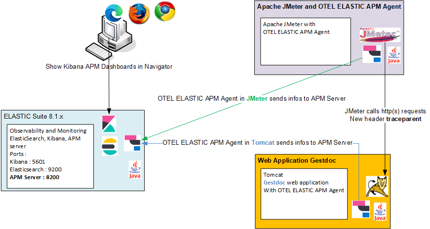

<p align="center">


  <p align="center">Apache JMeter tool plugin to Manage the integration of OpenTelemetry from Elastic Application Performance Monitoring in a JMeter script.</p>
  <p align="center"><a href="https://github.com/vdaburon/otel-apm-jmeter-plugin">Link to github project otel-apm-jmeter-plugin</a></p>
</p>

# Apache JMeter tool plugin to manage the OpenTelemetry Elastic Application Performance Monitoring (OTEL ELASTIC APM) in JMeter script

## GUI interface in the JMeter Tools Menu
This tool is present in the Menu Tools > vdn@github - OTEL ELASTIC APM Integration Tool



When you click and the menu line "vdn@github - OTEL ELASTIC APM Integration Tool", the tool GUI is display



### Parameters
Parameters are :
* file_in the JMeter script to read
* file_out the file result, if the text field is empty then the file_out is the file name of file_in without the extension with suffix "_modif.jmx" <br/>
  e.g. file_in = script1.jmx, file_out is empty then file_out will be script1_modif.jmx
* action = ADD or REMOVE, 
  * ADD = Add "User Defined Variables for OTEL_ACTIVE", add a "setUp Thread Group for init OpenTelemetry" contains JSR22 Groovy code and add "JSR223 groovy otel api call"
  * REMOVE = remove "User Defined Variables for OTEL APM", remove "setUp Thread Group for init OpenTelemetry" and children, and remove "JSR223 groovy otel api call", the script will be as before action ADD
* regex the regular expression matches the "Transaction Controller" label, if the label doesn't match the regular expression then **NO** "JSR223 groovy otel api" surround the "Transaction Controller"
  * default all = .* (this regular expression matches all labels)
  * e.g. regex = SC\d+_P.+ matches labels "SC01_P01_LOGIN" or "SC20_P12B_LOGOUT" or SC01_P01_LOGIN|SC02_P02_FIND|SC02_P012_LOGOUT for some Transaction Controllers

Button "MODIFY SCRIPT", this button launch the tool with parameters.<br/>
Button "MODIFY SCRIPT AND LOAD NEW SCRIPT", this button launch the tool with parameters and next if no error LOAD the generated script in the current JMeter.

Status, the status line contains the tool status or the tool result.

e.g. : Status Results **OK**
* Tool OTEL ELASTIC APM Integration Finished OK, ACTION = ADD, fileOut=C:\Temp\script1_add.jmx
* Tool OTEL ELASTIC APM Integration Finished OK, ACTION = REMOVE, fileOut=C:\Temp\script1_add_modif.jmx

e.g. : Status Results **KO**
* Tool OTEL ELASTIC APM Integration Finished KO, CAN'T READ jmx fileIn = C:\Temp\script1zzzz.jmx
* Tool OTEL ELASTIC APM Integration Finished KO, exception = java.util.regex.PatternSyntaxException: Unmatched closing ')' near index 1 .*)
* Tool OTEL ELASTIC APM Integration Finished KO, CAN'T CREATE or jmx file doesn't exist (look in the log file), fileOut  = c:\toto (in log file : java.io.FileNotFoundException: c:\toto (Access denied)
  )

## More documentation from jmeter-otel-apm project
For more documentation (configuration of the OpenTelemetry ELASTIC Java Agent, download OTEL Elastic Java Agent, JMeter start script shell modified ...) look at README from [jmeter-otel-apm](https://github.com/vdaburon/jmeter-otel-apm)

All Transactions in Kibana APM Dashboards with the vision of the page in JMeter (JMeter Transaction Controller usually == page) (click on image to see the full size image)



And the TIMELINE for JMeter Transaction Controller, you see the JMeter Page and the web application gestdoc running in Tomcat (click on image to see the full size image)



## Simplified architecture diagram
The simplified architecture : Apache JMeter and a Java OTEL Elastic Agent, Apache Tomcat and the Java OTEL Elastic Agent with web application gestdoc, ElasticSearch suite with ElasticSearch, APM Server and Kibana, a user views the Kibana Dashboards with navigator.



## Command line tool (CLI)
This tool could be use with script shell Windows or Linux.

Scripts shell are in &lt;JMETER_HOME&gt;/bin
* otel-apm-integrate.cmd for Windows OS
* otel-apm-integrate.sh for Linux/Mac OS

Help to see all parameters :

<pre>
C:\apache-jmeter\bin&gt;otel-apm-integrate.cmd -help
usage: io.github.vdaburon.jmeter.otelxml.OtelJMeterManager -action &lt;action&gt; [-extract_end &lt;extract_end&gt;] [-extract_start
       &lt;extract_start&gt;] [-extract_udv &lt;extract_udv&gt;] -file_in &lt;file_in&gt; -file_out &lt;file_out&gt; [-help] [-regex &lt;regex&gt;]
io.github.vdaburon.jmeter.otelxml.OtelJMeterManager
 -action &lt;action&gt;                 action ADD or REMOVE, ADD : add groovy api call and REMOVE : remove groovy api call
 -extract_end &lt;extract_end&gt;       optional, file contains groovy end call api (e.g : extract_end.xml), default read file
                                  in the jar
 -extract_start &lt;extract_start&gt;   optional, file contains groovy start call api (e.g : extract_start.xml), default read
                                  file in the jar
 -extract_udv &lt;extract_udv&gt;       optional, file contains User Defined Variables and setUp Thread Group for init
                                  OpenTelemetry (e.g : extract_udv.xml), default read file in the jar
 -file_in &lt;file_in&gt;               JMeter file to read (e.g : script.jmx)
 -file_out &lt;file_out&gt;             JMeter file modified to write (e.g : script_add.jmx)
 -help                            Help and show parameters
 -regex &lt;regex&gt;                   regular expression matches Transaction Controller Label (default .*) (e.g : SC[0-9]+_.
                                  for SC01_P01_HOME or SC09_P12_LOGOUT)
E.g : java -jar jmeter-otel-apm-&lt;version&gt;-jar-with-dependencies.jar -file_in script1.jmx -file_out script1_add.jmx
-action ADD -regex SC.*
E.g : java -jar jmeter-otel-apm-&lt;version&gt;-jar-with-dependencies.jar -file_in script1_add.jmx -file_out
script1_remove.jmx -action REMOVE -regex .*
</pre>

e.g. action = ADD :
<pre>
C:\apache-jmeter\bin>otel-apm-integrate.cmd -file_in C:\temp\script1.jmx -file_out C:\temp\script1_add_cli.jmx -action ADD -regex SC.*
</pre>

e.g. action = REMOVE :
<pre>
/var/opt/apache-jmeter/bin>otel-apm-integrate.sh -file_in /tmp/script1_add.jmx -file_out /tmp/script1_remove_cli.jmx -action REMOVE
</pre>

## Tool installed with jmeter-plugins-manager
This tool could be installed with the jmeter-plugins-manager from https://jmeter-plugins.org/<br>
The tool name is : "vdn@github - otel-apm-tool"

## Usage Maven
The maven groupId, artifactId and version, this plugin is in the **Maven Central Repository** [](https://maven-badges.herokuapp.com/maven-central/io.github.vdaburon/otel-apm-jmeter-plugin)

```xml
<groupId>io.github.vdaburon</groupId>
<artifactId>otel-apm-jmeter-plugin</artifactId>
<version>1.0</version>
```
## Versions
version 1.0  2025-01-15, First release

